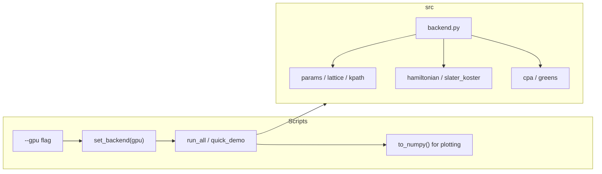

# PyTorch backend with --gpu CLI

## Design

- **Single code path**: Core `src` modules use a shared backend object for all array creation and linalg (no duplicate implementations). When `--gpu` is used, the backend is PyTorch (CUDA if available); otherwise NumPy.
- **CLI**: Add `--gpu` to [scripts/run_all.py](scripts/run_all.py) and [scripts/quick_demo.py](scripts/quick_demo.py). Set backend before any `src` imports that depend on it. Matplotlib continues to receive NumPy arrays via `backend.to_numpy()`.
- **Scope of changes**: New file [src/backend.py](src/backend.py); edits in [src/params.py](src/params.py), [src/lattice.py](src/lattice.py), [src/kpath.py](src/kpath.py), [src/slater_koster.py](src/slater_koster.py), [src/hamiltonian.py](src/hamiltonian.py), [src/cpa.py](src/cpa.py), [src/greens.py](src/greens.py), and both scripts. Tests remain NumPy-only unless we add an optional GPU run.

## 1. Backend module

Add **src/backend.py** that:

- Exposes `set_backend(use_gpu: bool)` and `get_backend()` (e.g. `"numpy"` or `"torch"`). Lazy-import `torch` only when `use_gpu=True`; if CUDA is unavailable, fall back to NumPy and warn.
- Provides a unified API used by the rest of the package so the same code runs for both backends:
  - **Creation**: `array`, `zeros`, `eye`, `asarray` (and `to_numpy` for scripts/plotting).
  - **Linalg**: `inv`, `eigvalsh` (real part of eigh), `norm` (vector/matrix).
  - **Math**: `exp`, `dot` (matrix multiply / matmul for 2D), `kron`, `conj`, `T` (transpose), `H` (conj.T).
  - **Reductions**: `trace` (including axis1/axis2 for batched), `real`, `imag`, `abs`, `max`, `min`, `sum`, `mean`.
- For **NumPy**: thin wrappers that call `np.*` and return ndarrays.
- For **PyTorch**: same names implemented with `torch`/`torch.linalg`, placing tensors on `device` (e.g. `cuda:0` when available). Use `torch.linalg.inv`, `torch.linalg.eigvalsh` (then `.real`), etc. Handle batched `trace` with `torch.diagonal` or equivalent so `trace(gloc_atom, axis1=1, axis2=2)` works for shape `(Ne, norb, norb)`.

Backend must be set **before** any code that creates arrays (e.g. at script start, before building kgrid/params). So in scripts: parse args → `set_backend(args.gpu)` → then import from `src` (or keep imports at top and set backend at the very start of `main()` so that when we call `monkhorst_pack`, etc., backend is already set).

## 2. Core modules switched to backend

In each module, replace direct `numpy` usage with the backend API so that a single implementation works for both backends.

- **params.py**: Use backend for `onsite_matrix` (diag-like construction) and keep `mix_params_vca` scalar except for `np.sqrt` → backend or keep as Python `math.sqrt` for scalars. `disorder_onsites` returns backend arrays.
- **lattice.py**: All `np.array`, `np.zeros`, `np.dot`, `np.cross` → backend equivalents. Return backend arrays.
- **kpath.py**: `make_kpath`, `kpath_distances`: same; use backend for arrays and `norm`.
- **slater_koster.py**: Build 5×5 matrix with backend `zeros` and indexing; `direction` may be backend array → use backend for any math (e.g. normalize).
- **hamiltonian.py**: All matrix construction, `exp`, `dot`, `kron`, `eye`, `zeros` → backend. `p_soc_matrix` and `bloch_hamiltonian_sp3s_star` / `hopping_only_matrix` return backend arrays.
- **cpa.py**: `embed_onsite_in_cell`, `cpa_solve_energy`, `cpa_solve_grid`: use backend for `zeros`, `eye`, `inv`, `asarray`, `copy`, `abs`, `max`. Keep the same loop-over-energy structure; per-energy k-loop can stay as-is (or later be batched on GPU for speed; not required for this plan). Return dict values as backend arrays.
- **greens.py**: `dos_from_eigs`, `dos_from_gloc`, `spectral_function_k`, `spectral_map_kpath`: use backend for `trace`, `inv`, `eye`, `imag`, `zeros`, and any reductions. Return backend arrays.

Type hints can stay as `np.ndarray` or use `Union[np.ndarray, torch.Tensor]` / a type alias from backend for “array-like” if desired; optional for minimal change.

## 3. Scripts: add --gpu and convert for plotting

- **run_all.py** and **quick_demo.py**:
  - Add `ap.add_argument("--gpu", action="store_true", help="Use PyTorch GPU backend")`.
  - At the start of `main()`, call `from src.backend import set_backend, to_numpy` and `set_backend(args.gpu)`.
  - After computing `bands`, `energies`, `s`, `dos_vca`, `dos_cpa`, `A_cpa`, and any array passed to `plt.plot`/`imshow`/`fig.savefig`, convert with `to_numpy(...)` so matplotlib always gets NumPy. For example: `bands = to_numpy(bands)`, `energies = to_numpy(energies)`, `s = to_numpy(s)`, `dos_vca = to_numpy(dos_vca)`, `dos_cpa = to_numpy(dos_cpa)`, `A_cpa = to_numpy(A_cpa)`. Same for `sigma_atom` / `tr_sigma` in quick_demo before plotting.
  - Keep existing `import numpy as np` only where still needed (e.g. for `np.min`/`np.max` on already-converted arrays, or use backend and then convert once at the end for plotting).

## 4. Dependencies and tests

- **requirements.txt**: Add `torch` (optional dependency is possible via extras, but for simplicity listing `torch` is fine; installs with `pip install -r requirements.txt`).
- **tests**: Leave [tests/test_basic.py](tests/test_basic.py) as-is (NumPy only); no `set_backend(True)` so default remains NumPy. Optional: document or add a small check that `set_backend(False)` runs as before.

## Data flow (high level)

## File change summary

| File                      | Action                                                                          |
| ------------------------- | ------------------------------------------------------------------------------- |
| `src/backend.py`       | **New**: backend API + NumPy/PyTorch implementations, `set_backend`, `to_numpy` |
| `src/params.py`        | Use backend for `onsite_matrix` (and any array creation)                        |
| `src/lattice.py`       | Use backend for all array/linalg ops                                            |
| `src/kpath.py`         | Use backend for arrays and norm                                                 |
| `src/slater_koster.py` | Use backend for matrix construction                                             |
| `src/hamiltonian.py`   | Use backend for all matrix/exp/dot/kron ops                                     |
| `src/cpa.py`           | Use backend for linalg and array creation                                       |
| `src/greens.py`        | Use backend for linalg and array creation                                       |
| `scripts/run_all.py`      | Add `--gpu`, call `set_backend`, wrap plotting inputs with `to_numpy`           |
| `scripts/quick_demo.py`   | Add `--gpu`, call `set_backend`, wrap plotting inputs with `to_numpy`           |
| `requirements.txt`        | Add `torch`                                                                     |

No changes to `src/__init__.py` or test logic required for basic behavior; tests keep using default NumPy backend.